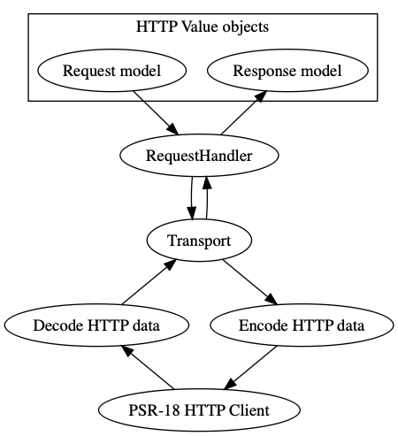

# HTTP-Tools - Experimental (!)

The goal of this package is to provide you some tools to set-up a consistent HTTP integration.
The HTTP client implementation you want to use is just a small implementation detail and doesn't matter.
However, here are some default guidelines:

## Installation

```
composer require phpro/http-tools
```

*Note*: You'll also need to require PSR-18 HttpClient like `symfony/http-client` or `guzzlehttp/guzzle`

## Setting up an HTTP client :

Setting up an HTTP client is done by using a factory.
The factory accepts a list of implementation specific plugins / middlewares.
Besides that, you can send options like a base_uri or default headers.

```php
<?php

use Phpro\HttpTools\Client\Configurator\PluginsConfigurator;
use Phpro\HttpTools\Client\Factory\AutoDiscoveredClientFactory;
use Phpro\HttpTools\Client\Factory\GuzzleClientFactory;
use Phpro\HttpTools\Client\Factory\SymfonyClientFactory;

$options = ['base_uri' => $_ENV['SOME_CLIENT_BASE_URI']];

$httpClient = AutoDiscoveredClientFactory::create($middlewares);
$httpClient = GuzzleClientFactory::create($guzzlePlugins, $options);
$httpClient = SymfonyClientFactory::create($middlewares, $options);

// You can always create your own factory if you want to have more control or want to use another tool!

// If you are using guzzle, you can both use guzzle and httplug plugins.
// You can wrap additional httplug plugins like this:
$httpClient = PluginsConfigurator::configure($httpClient, $middlewares);
```

**Note:** This package does not download a specific HTTP implementation. You can choose whatever package you want, but you'll have to manually add it to composer.

### Configuring the client through plugins

[Plugin](http://docs.php-http.org/en/latest/plugins/index.html)-[Middleware](http://docs.guzzlephp.org/en/stable/handlers-and-middleware.html) : Patato-Patato. 

If you want to extend how an HTTP client works, we want you to use plugins!
You can use plugins for everything: logging, authentication, language specification, ...

Examples:

```php
<?php

$middlewares = [
    new Phpro\HttpTools\Plugin\AcceptLanguagePlugin('nl-BE'),
    new App\SomeClient\Plugin\Authentication\ServicePrincipal($_ENV['API_SECRET']),
];
```

**Built-in plugins**:

- `AcceptLanguagePlugin`: Makes it possible to add an Accept-Language to a request.

**Remember**: [There are a shitload of HTTPlug middleware available already.](http://docs.php-http.org/en/latest/plugins/) Try on of them before writing your own one!

### Logging

This package contains the `php-http/logger-plugin`.
On top of that, we've added some decorators that help you strip out sensitive information from the logs.
You can switch from full to simple logging by specifying a debug parameter!

```php
<?php

use Phpro\HttpTools\Formatter\RemoveSensitiveHeadersFormatter;
use Phpro\HttpTools\Formatter\RemoveSensitiveJsonKeysFormatter;

$middlewares[] = new Http\Client\Common\Plugin\LoggerPlugin(
    $logger,
    new RemoveSensitiveHeadersFormatter(
        new RemoveSensitiveJsonKeysFormatter(
            BasicFormatterFactory::create($debug = true, $maxBodyLength = 1000),
            ['password', 'oldPassword', 'refreshToken']
        ),
        ['X-Api-Key', 'X-Api-Secret']
    )
); 
```

[More info ...](http://docs.php-http.org/en/latest/plugins/logger.html)

## Using the HTTP-Client

We don't want you to use the PSR-18 client directly! Instead, we suggest you to use a request handler principle.
So what does this architecture look like?



* **Models**: Request / Response value objects that can be used as wrapper around raw arrays.
* **RequestHandler**: Transform a request into a response model by using a transport. You could add error handling in there as well.
* **Transport**: Transforms a Request model into a PSR-7 HTTP request and asks a response through the actual HTTP client. As an example, you could take the example of the: `JsonTransport`.
* **HTTP-Client**: Whichever PSR-18 HTTP client you want to use: guzzle, curl, symfony/http-client, ...


By using this architecture, we provide an easy to extend flow with models that replace cumbersome array structures.  


You might be familiar with 1 "client" class that provides access to multiple API endpoints. We see that approach as a multi-requesthandler class.
You are free to choose that approach, owever, we suggest using 1 request handler per API endpoint.
This way, you can inject / mock only the things you require at that moment into your codebase.

Example implementation:

```php
<?php
use Http\Discovery\Psr17FactoryDiscovery;
use Phpro\HttpTools\Transport\Json\JsonTransport;
use Phpro\HttpTools\Uri\TemplatedUriBuilder;

$transport = App\SomeClient\Transport\MyCustomTransportWrapperForDealingWithIsErrorPropertyEg(
    JsonTransport::createWithAutodiscoveredPsrFactories(
        $httpClient,
        new TemplatedUriBuilder()
    )
);
```

Example request handler: 

```php
<?php

use Phpro\HttpTools\Transport\TransportInterface;

class ListSomething
{
    public function __construct(
        private TransportInterface $transport
    ) {}

    public function __invoke(ListRequest $request): ListResponse
    {
        // You could validate the result first + throw exceptions based on invalid content
        // Tip : never trust APIs!
        // Try to gracefully fall back if possible and keep an eye on how the implementation needs to handle errors!

        return ListResponse::fromRawArray(
            ($this->transport)($request)
        );    
    }
}
```

```php
<?php

use Phpro\HttpTools\Request\RequestInterface;

// By wrapping the request in a Value Object, you can use named constructors to pass in filters and POST data.
// You can add multiple named constructors if you want the list to behave in different ways in some cases.

class ListRequest implements RequestInterface
{
    public function method() : string
    {
        return 'GET';
    }

    public function uri() : string
    {
        return '/list{?query}'; 
    }

    public function uriParameters() : array
    {
        return [
            'query' => 'somequery',
        ];
    }

    public function body() : array
    {
        return [];
    }
}

// By wrapping the response in a Value Object, you can sanitize and normalize data.
// You could as well lazilly throw an exception in here if some value is missing.
// However, that's might be more of a task for a request-handler.

class ListResponse
{
    public static function fromRawArray(array $data): self
    {
        return new self($data);    
    }

    public function getItems(): array
    {
        // Never trust APIs!
        return (array) ($this->data['items'] ?? []);
    }
}
```

## Async request handlers

This package also provides a transport for async HTTP clients.
The architecture can remain as is.
A request handler can be implemented in a lazy or awaiting state.

We use the Promise component from [Amp](https://amphp.org/), to make it fully integrateable with fully Async codebases.  

```php
<?php

use Amp\Promise;
use Phpro\HttpTools\Transport\AsyncTransportInterface;
use function Amp\call;
use function Amp\Promise\wait;

class ListSomething
{
    public function __construct(
        private AsyncTransportInterface $transport
    ) {}

    /**
     * @return Promise<ListResponse>
     */
    public function lazy(ListRequest $request): Promise
    {
        return call(function () use ($request) {
            $data = yield ($this->transport)($request);

            return ListResponse::fromRawArray($data);  
        });
    }
    
    public function await(ListRequest $request): ListResponse
    {
        return wait($this->lazy($request));
    }
}
``` 

[More info ...](http://docs.php-http.org/en/latest/components/promise.html)

## Testing HTTP clients

This tool provided some traits for unit testing your API client with PHPUnit.

### UseHttpFactories

This trait can help you build requests and responses inside your tests without worrying what HTTP package you use:

* `createRequest`
* `createResponse`
* `createStream`

### UseMockClient

*Includes `UseHttpFactories` trait*

Preferably, this one will be used to test your own middlewares and transports.
It is also possible to test a request-handler, but you'll have to manually provide the response for it.

example:

```php
<?php
use Http\Mock\Client;
use \Phpro\HttpTools\Test\UseMockClient;

class SomeTest extends TestCase
{
    use UseMockClient;
    
    protected function setUp(): void
    {
        // You can configure the mock client through a callback.
        // Or you can skip the callback and configure the result of this method.
        $this->client = $this->mockClient(function (Client $client): Client {
            $client->setDefaultException(new \Exception('Dont call me!'));
            return $client;
        });
    }    
}
```

[More info ...](http://docs.php-http.org/en/latest/clients/mock-client.html)

### UseVcrClient

*Includes `UseHttpFactories` trait*

This one can be used to test your request-handlers with realtime data.
The first you use it in your test, it will do the actual HTTP request.
The response of this request will be recorded and stored inside your project.
The second time the test runs, it will use the recorded version.

example: 

```php
<?php
use Http\Client\Plugin\Vcr\NamingStrategy\PathNamingStrategy;
use Phpro\HttpTools\Client\Factory\AutoDiscoveredClientFactory;
use Phpro\HttpTools\Test\UseVcrClient;

class SomeTest extends TestCase
{
    use UseVcrClient;
    
    protected function setUp(): void
    {
        // Instead of the autodiscover client, you can use your own client factory.
        // That way, you can e.g. add the required authentication, ...
        $this->client = AutoDiscoveredClientFactory::create([
            ...$this->useRecording(FIXTURES_DIR, new PathNamingStrategy())        
        ]);
    }
}
```

[More info ...](http://docs.php-http.org/en/latest/plugins/vcr.html)
